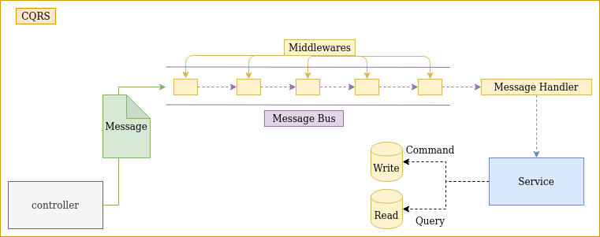

# CQRS

CQRS is a library whose objective is to facilitate the incorporation of the CQRS pattern in the project

## Installation

Use the package manager [pip](https://pip.pypa.io/en/stable/) to install CQRS.

```bash
pip install git+https://github.com/jesusce21/cqrs.git#egg=cqrs
```

## Usage

Directory tree example
```
|-- api
|    |-- buses
|    |  |-- command_bus.py
|    |  |-- query_bus.py
|    |-- controller
|    |  |-- search_example.py
|    |  |-- create_example.py
|    |-- queries
|    |  |-- example_query
|    |  |  |-- search_example_query.py
|    |  |  |-- search_example_query_handler.py
|    |-- commands
|    |  |-- example_command
|    |  |  |-- create_example_query.py
|    |  |  |-- create_example_query_handler.py
|    |-- middleware.py
|    |-- services
|    |  |-- example_searcher.py
|    |  |-- example_creator.py
```

`query_bus.py`
```python
from cqrs.message_bus.message_bus import MessageBus


class QueryBus(MessageBus):
    """
    Config to set the middleware used when you use the QueryBus
    """

    def __init__(self):
        super().__init__(middleware=[logger_middleware])
```

`command_bus.py`
```python
from cqrs.message_bus.message_bus import MessageBus


class CommandBus(MessageBus):
    """
    Config to set the middleware used when you use the CommandBus
    """

    def __init__(self):
        super().__init__(middleware=[logger_middleware, commit_middleware])
```

`middleware.py`
```python
import logging

def commit_middleware(message, next):
    try:
        next(message)
        # commit
    except Exception as e:
        # rollback
        raise e

def logger_middleware(message, next):
    try:
        logging.info(f'The message received is {message}')
        next(message)
        logging.info(f'The message has been processed correctly')
        # commit
    except Exception as e:
        # rollback
        raise e
```

`search_example_query.py`
```python
from cqrs.message.message import Message
from cqrs.message.message_interface import MessageInterface


class SearchExampleQuery(Message, MessageInterface):
    """
    Query message to get the examples
    """
    required_fields = ['example_type']
    __slots__ = [*required_fields, 'page', 'count']
    default_values = {'page': 1, 'count': 1000}

    @property
    def message_action(self) -> str:
        """
        Allows to get the event name
        :return:
        """
        return 'search_examples'
```

`search_example_query_handler.py`
```python
from query.example.search_example.search_example_query import SearchExampleQuery

class SearchExampleQueryHandler:
    def __init__(self, example_searcher: ExampleSearcher):
        self.service = example_searcher

    def handle(self, query: SearchExampleQuery):
        print(f"Do things {query.payload()}")
        return {"examples": ["example", "example1"]}
```

`get_examples_controller.py`
```python
async def list_examples(request):
    """
    Allow to get a list of examples
    :param request:
    :return:
    """
    payload = {
        "example_type": request.args.get("example_type", default=None, type=str),
        "page": request.args.get("page", default=None, type=int),
        "count": request.args.get("count", default=None, type=int)
    }
    # For Dependency Injection
    handler_config = {"example_searcher": ExampleSearcher(ExampleDalRepository())}

    return MessageManager.do_action(QueryBus, SearchExampleQuery,
                                    dict(message_uuid=uuid.uuid4(), payload=payload)
                                    , handler_config=handler_config)
```


`example_dal_controller.py`
```python
@set_connections("read_connection", "write_connection")
class ExampleDalRepository(DalRepository):
    def save(self, example: Example):
        self.write_connection.execute(
            f"INSERT INTO category(id, name) VALUES('{example.id}', '{example.name}');")

    def by_id(self, example_id):
        example = self.read_connection.execute(
            f"SELECT * FROM category WHERE id = '{example_id}';").fetchone()
        return example
```

set_connections
# Workflow

This is the flow of sending messages through the bus, a generic example has been explained, but one bus should be applied for queries and another for commands. Including this, the databases should be separated.




## License
[MIT](https://choosealicense.com/licenses/mit/)